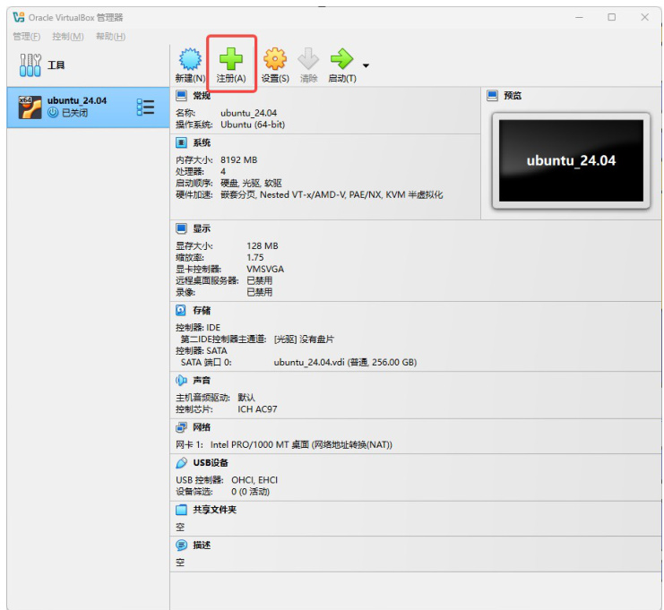

# Data Platfrom VM usage  

- [1. Installing VirtualBox](#1-installing-virtualbox)
- [2. Importing the Virtual Machine](#2-importing-the-virtual-machine)
- [3. Configuring Hardware Virtualization](#3-configuring-hardware-virtualization)
- [4. Accessing the Virtual Machine and Using the Data Platform](#4-accessing-the-virtual-machine-and-using-the-data-platform)

# 1. Installing VirtualBox  

To get started, download and install VirtualBox by following the official documentation: https://www.virtualbox.org/manual/topics/Introduction.html#intro-installing. Make sure to choose the correct version for your operating system.  

# 2. Importing the Virtual Machine  

a. **Save the Virtual Machine File Locally**  

Download and store the virtual machine file on your local computer.  

  

b. **Load the Virtual Machine**

Open VirtualBox and click on **Register** to access the virtual machine import interface.  

  

Navigate to the directory where the virtual machine file is stored, select and open the `ubuntu_24.04.vbox` file to load the virtual machine.  

  

# 3. Configuring Hardware Virtualization  

a. **Enable CPU Virtualization in BIOS**  

Restart your computer and enter the BIOS/UEFI settings. Look for an option related to **CPU Virtualization** (such as Intel VT- $\boldsymbol{\cdot}\boldsymbol{\times}$ or AMD-V) and enable it.  

b. **Disable Conflicting System Features in Windows** 

> i. Open the **Turn Windows features on or off** settings.  

> ii. Disable **Hyper-V, Windows Sandbox, Virtual Machine Platform**, and any other features that may interfere with VirtualBox.  

  

c. **Turn Off Memory Integrity**

> i. Open **Windows Security Center.**

> ii. Go to **Core Isolation** settings and disable the **Memory Integrity** option.  

  

d. **Enable Virtualization in VirtualBox**

> i. Open VirtualBox and go to **Settings** for the virtual machine.   

> ii. Navigate to **System $\rightarrow$ Processor**. 

> Enable **PAE/NX** and **VT-x/AMD-V** to ensure proper virtualization support.  

  

# 4. Accessing the Virtual Machine and Using the Data Platform  

a. **Start and Log into the Virtual Machine**  

Open VirtualBox and click the **Start** button to boot up the virtual machine.  

  

Log in using the following credentials:  

- **Password**: vboxuser
- Go to: http://localhost:27021/#/login?lang=en-US.
- Enter the following login credentials:   
- **Username**: administrator@example.com
- **Password**: password  

  

b. **Log into the Data Platform** 

Open a web browser inside the virtual machine.  

  

c. **Perform Data Operations** 

Once logged in, navigate through the main interface of the data platform to perform data-related tasks as needed.  

  
