# Trial accounts for some features

_Note:_
- _If the webpage does not respond when logging in, please try using a different browser (e.g., Safari)._
- _You can switch languages (EN/CN) from the top right corner of the webpage._

**Address**：http://8.152.212.170:27021/

**Account：**

> user：public_01@example.com
> 
> password：public_01

> user：public_02@example.com
> 
> password：public_02

> user：public_03@example.com
> 
> password：public_03

> user：public_04@example.com
> 
> password：public_04

> user：public_05@example.com
> 
> password：public_05

---

# Data Platform Demo: Data Generation  

# 1. Check the data dashboard to determine the data production strategy  

Open the browser and go to http://8.152.212.170:27019/public/dashboard/6667a609-a8df4b01-9c46-8a942440788d to access the data dashboard.  

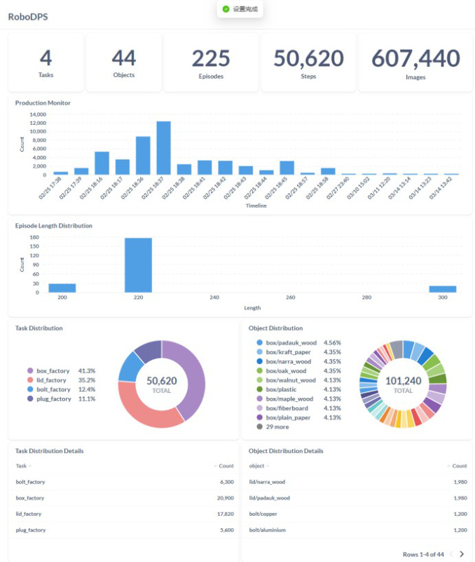  

# Dataset Overview:  

Display the statistics of the data in the dataset:  

$\bigcirc$ Tasks: Number of task types   
$\bigcirc$ Objects: Number of object types interacted with in the tasks   
$\bigcirc$ Episodes: Number of episodes   
$\bigcirc$ Steps: Number of steps   
$\bigcirc$ Images: Number of data frame images  

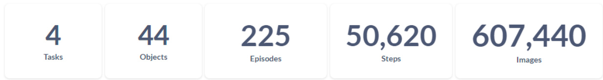  

# Production Monitor:  

Display the working time of data production tasks and the amount of data produced.  

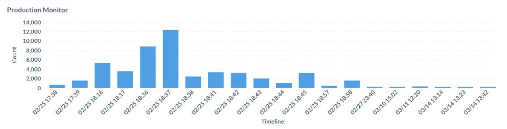  

# Episode Length Distribution:  

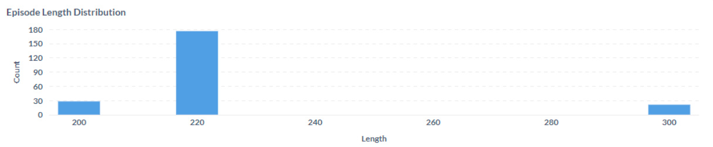  

# Task Distribution:  

Display the distribution of tasks across different categories, such as task types, complexity levels, or assigned resources.  

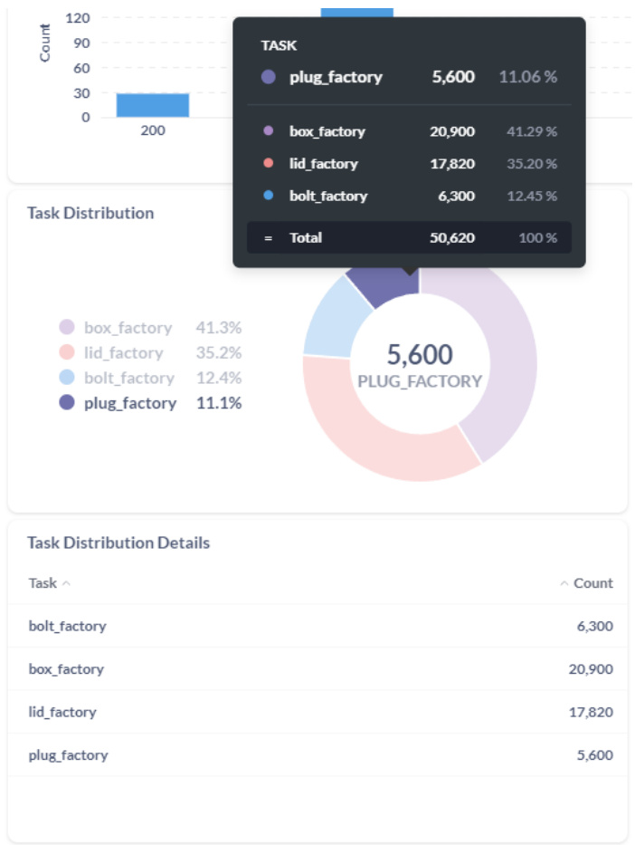  

Object Distribution: Display the distribution of objects across different categories or types within the dataset.  

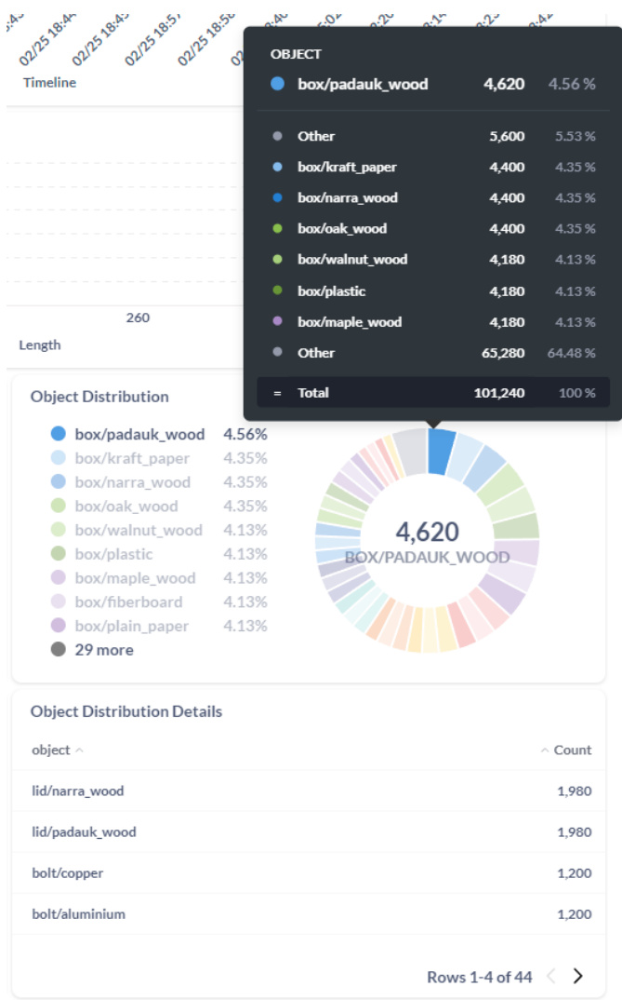  

The plug_factory task type has relatively little data. Next, we'll use it as an example to generate new data.  

# 2. Data Generation  

To generate data on the platform, follow these steps:  

1. Open the browser and go to http://8.152.212.170:27021/#/dashboard. Enter your username and password to access the data platform's homepage.  

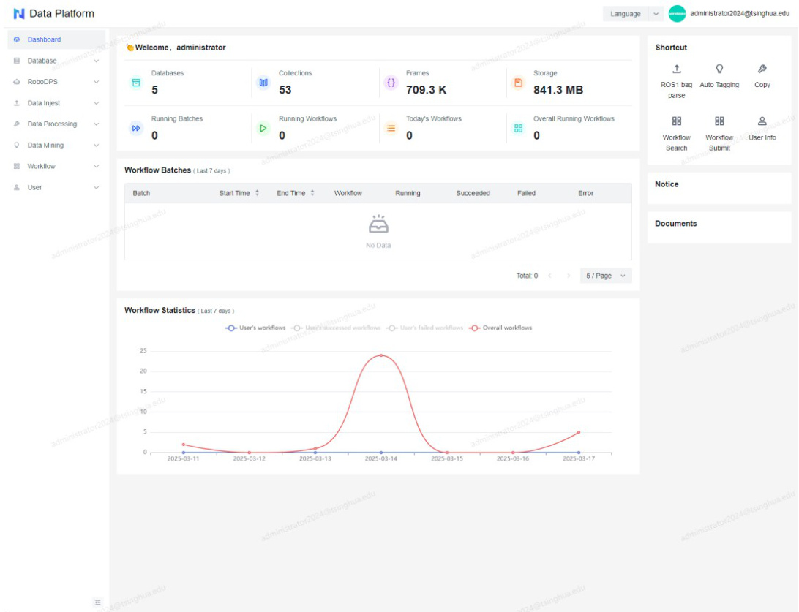  

# 2. Open the RoboDPS/Data Produce page:  

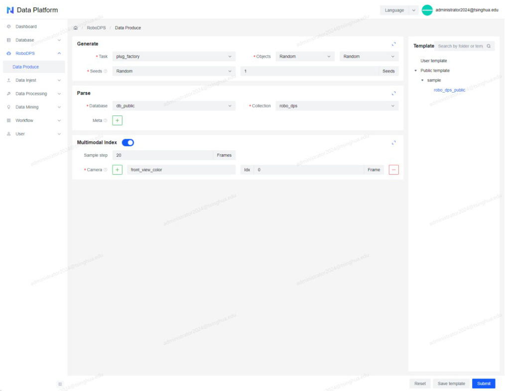  

# 3. Configure the parameters and submit the data generation task:  

Below are the required parameters for this data generation task and their descriptions.  

<html><body><table><tr><td rowspan="4">Gener ate</td><td>Task</td><td>The task type for the robotic arm operation, set to plug factory in this example.</td></tr><tr><td>Objects</td><td>The type of object interacting with the robotic arm, set to random in this example.</td></tr><tr><td>Seeds</td><td>The random seed for initializing object positions and other randomized parameters in the task.</td></tr><tr><td>Databa se</td><td>The database where the generated data will be stored.</td></tr><tr><td rowspan="2"></td><td>Collecti on</td><td>The collection where the generated data will be stored.</td></tr></table></body></html>  

# 4. Monitor the data generation process:  

After creating the task, click the workflow link in the popup to navigate to the workflow details page and check the task progress.  

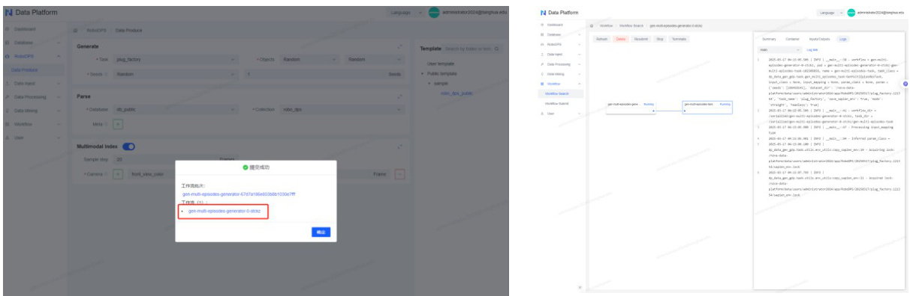  

# 3. Data Visualization  

Once the data is generated, you can visualize it for better understanding and analysis. Here's how you can proceed:  

# 1 Navigate to the Database section:  

Open the target dataset based on the configuration from the data generation task. In this document's example, the target database is db_public, and the target collection is robo_dps.  

a. In the Database list, select the db_publicto open the list of collections within the db_public database.  

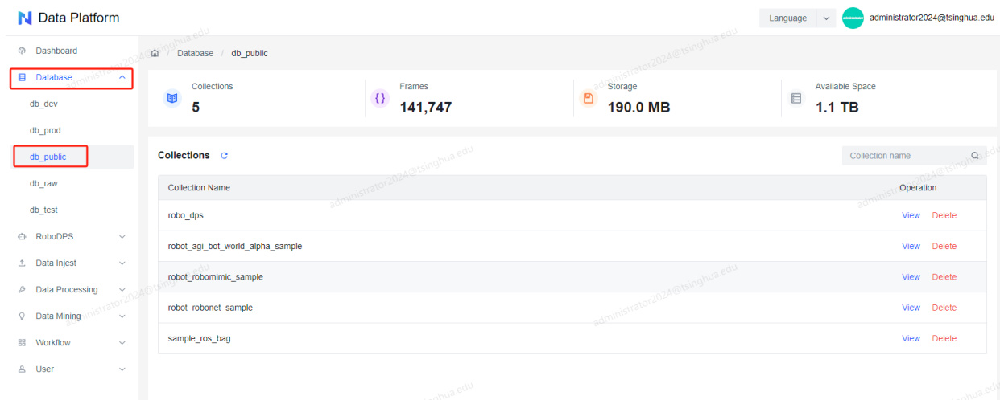  

b. In the Collections list, click View under the Operation column for robo_dps to enter the dataset details page for the robo_dps collection.  

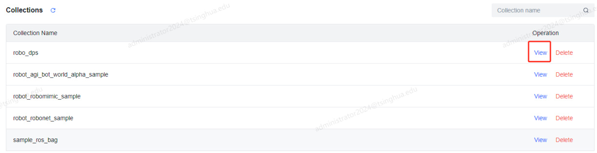  

# 2. View the data frame:  

In the dataset details page for the robo_dps collection, you will see a list of data frames. From here, you can select and view each individual data frame.  

a. Click the View button on the right side of the data frame list to enter the individual data frame's visualization page.  

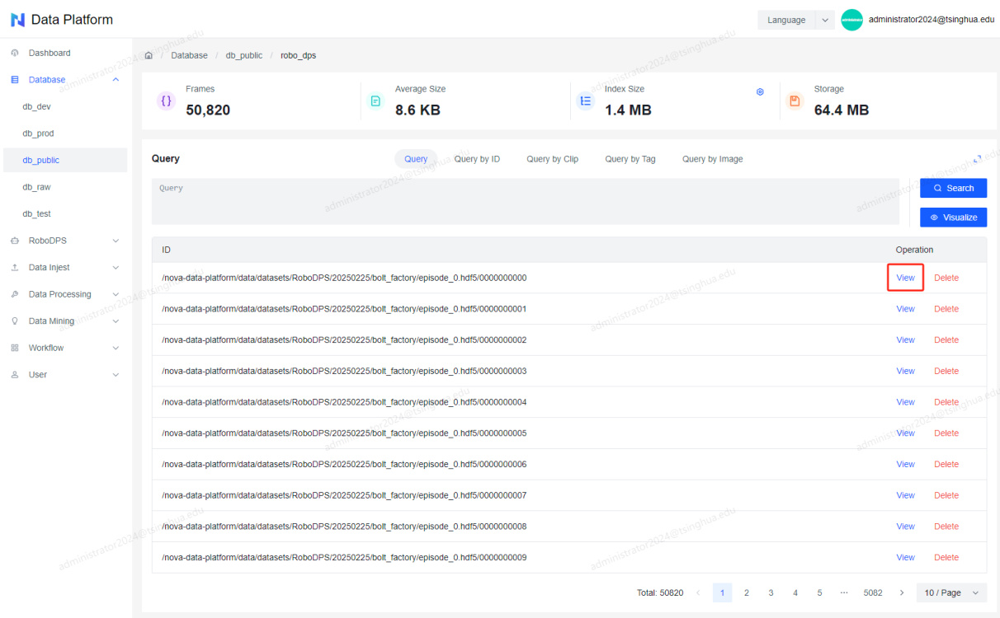  

b. In the individual data frame visualization page, the left side displays the description file of the current data frame, while the right side shows the visualization of the current frame's data. You can switch between different visualizations using the dropdown menu on the right.  

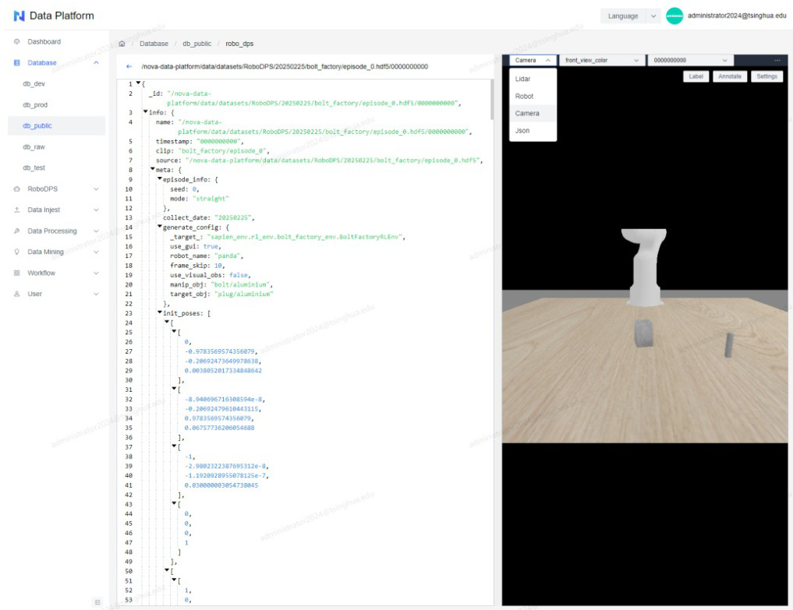  

# 3. Dataset Visualization:  

a. Click the Visualize button in the collection details page to enter the dataset visualization interface.  

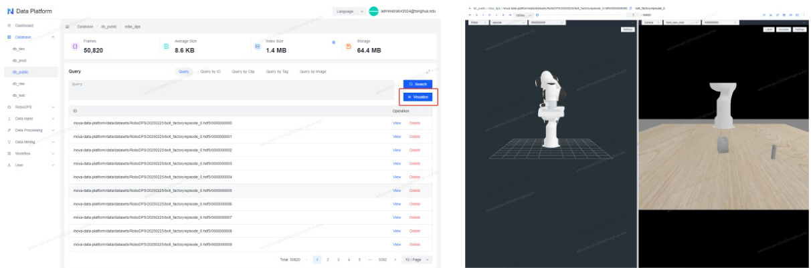  

b. You can split the visualization panel downward or to the right, or remove a panel, using the options available in the top-right corner of the interface.  

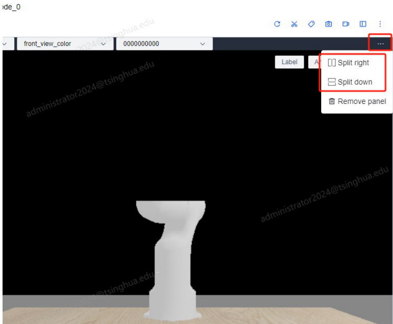  

c. Use the dropdown menu to switch between different sensors and datasets for visualization.  

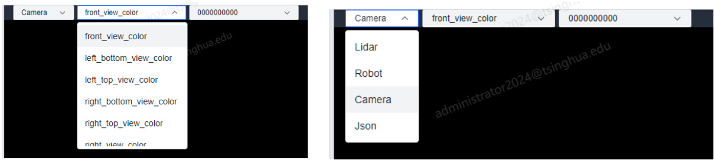  

d. In the model visualization panel, you can set it to display the robotic arm's predicted movement path.  

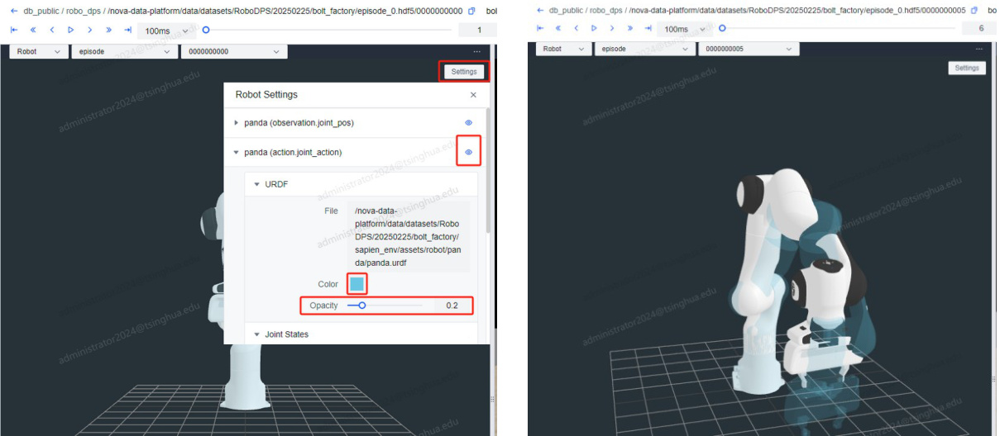  

e. Click the Play button in the top-left corner to play the entire dataset continuously, frame by frame.  

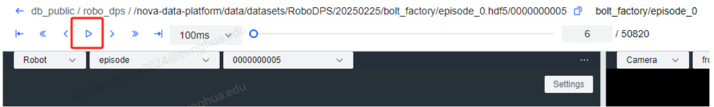  

# 4. Data Retrieval  

In the collection details page, you can retrieve data using multiple methods:  

# 1. MongoDB Query:  

In the collection details page, under the Query section, select the Query option. Use a query statement to retrieve specific data. For example, to filter all data with the task type plug_factory, use the following query:  

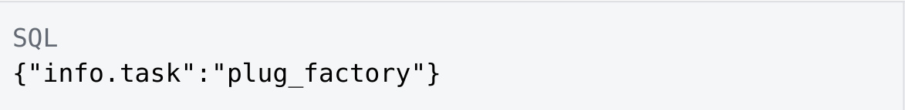  

This will filter and display all data where the task type is set to plug_factory.  

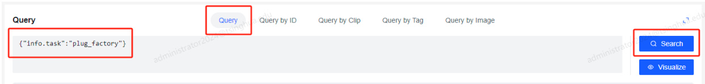  

# 2. Natural language:  

In the collection details page, under the Query section, select the Query by Image option. Then, use natural language to search for data. For example, to filter all data frames that contain a green board, enter the following query:  

# "green board"  

Click Search, and the system will return all data frames that match the description of having a green board in the scene.  

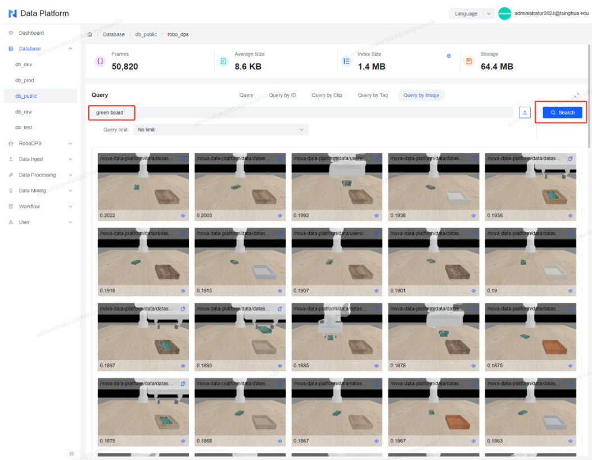  

# 5. Data Copying  

Using the data copy function, you can copy data from a public dataset to a private dataset, or filter data from a dataset to create a subdataset with specific content. In this example, we will filter the data with the task type plug_factory and copy it to a new dataset called robo_dps_copy.  

1. Navigate to the Data Processing/Copy page.  

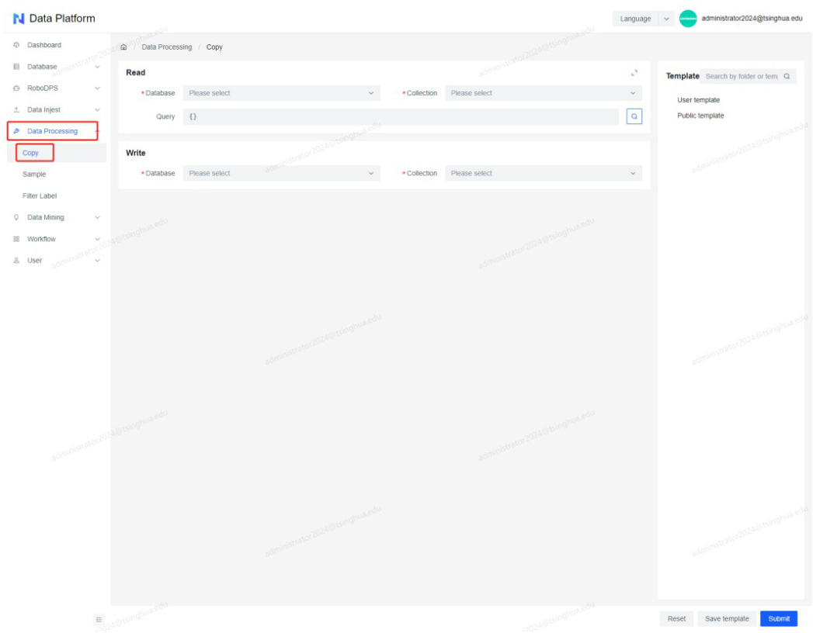  

2.  

Configure Read Parameters:  

Database: Select the source database (e.g., db_public).  

$\bigcirc$ Collection: Choose the source collection (e.g., robo_dps).  

$\bigcirc$ Query: Use the following query to filter data with task type plug_factory:  

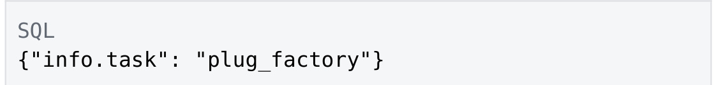  

#  

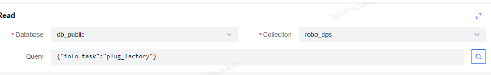  

# 3. Configure Write Parameters:  

$\bigcirc$ Database: Select the target database (e.g., db_private).  

$\bigcirc$ Collection: Set the target collection to robo_dps_copy.  

These parameters can be specified freely. If the target collection does not exist, the data platform will automatically create it.  

Important Note: When creating a new target collection that doesn't exist, you need to manually type the collection name in the Collection field and press Enter to confirm before proceeding.  

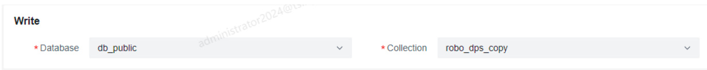  

# 4. Execute the Copy:  

After configuring the parameters, initiate the copy process.  

# 5. Verify the Copied Data:  

After submitting the data copy task and completing the process, you can view the copied dataset in the dataset list. In this example, navigate to Database/dp_public/robo_dps_copy to view the copied dataset.  

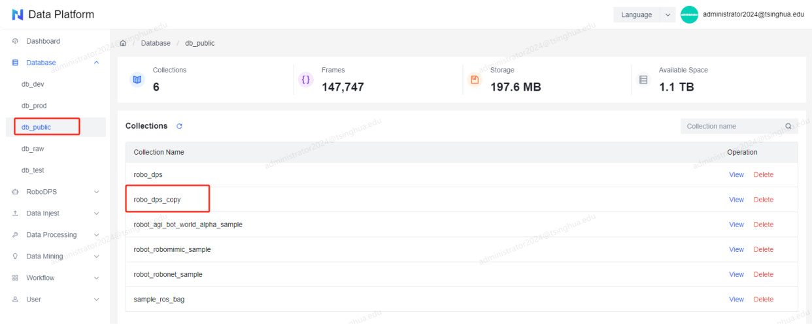  
